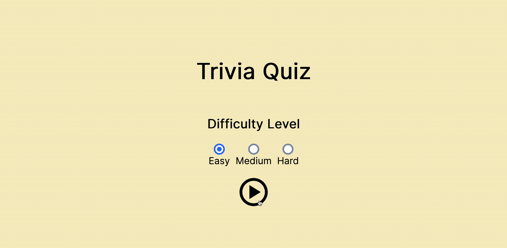

# Trivia Quiz

## Description

This project is developed in React using the Vite build tool. It allows users to play endless, funny, food-related multiple-choice quiz questions to pass the time

## Features

- Select difficulty level
- Provides an intuitive way to determine if the user's selected choice is correct (green: correct, red: wrong)
- Ability to see the correct question even if the user selects the wrong choice

## Helpful Resources

- [Postman](https://www.postman.com) for playing with "The Trivia API" during development
- [React Icons](https://react-icons.github.io/react-icons)
- [The Trivia API](https://the-trivia-api.com)

## What I learned from this project

- Use radio button and label in React
- Display loading status and errors, in addition to the actual data, when fetching data from an external API for improved usability
